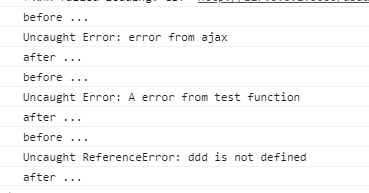

# 前端知识点总结（JavaScript篇）


1. **同源策略及跨域请求的方法和原理（比较JSONP和document.domain的不同及优劣，以及HTML5的跨域方案）**
2. **JavaScript数据类型**
3. **JavaScript字符串转化**
4. **JSONP原理及优缺点**
5. **XMLHttpRequest**
6. **事件委托**
7. **前端模块化（AMD和CommonJS的原理及异同，seajs和requirejs的异同和用法）**
8. **session**
9. **Cookie**
10. **seaJS的用法及原理，依赖加载的原理、初始化、实现等**
11. **this问题**
12. **模块化原理（作用域）**
13. **JavaScript动画算法**
14. **拖拽的实现**
15. **JavaScript原型链及JavaScript如何实现继承、类的**
16. **闭包及闭包的用处，以及闭包可能造成的不良后果。**
17. **常见算法的JS实现（如快排、冒泡等）**
18. **事件冒泡和事件捕获**
19. **浏览器检测（能力检测、怪癖检测等）**
20. **JavaScript代码测试**
21. **call与apply的作用及不同**
22. **bind的用法，以及如何实现bind的函数和需要注意的点**
23. **变量名提升**
24. **== 与 ===**
25. **"use strict"作用**
26. **AJAX请求的细节和原理**
27. **函数柯里化（Currying）**
28. **NodeJS健壮性方面的实践（子进程等）**
29. **NodeJS能否用利用多核实现在计算性能上的劣势等**
30. **jQuery链式调用的原理**
31. **ES6及jQuery新引进的Promise有什么用处、Promise的原理**
32. **NodeJS的优缺点及使用场景**
33. **JS中random的概率问题**
34. **客户端存储及他们的异同（例如：cookie, sessionStorage和localStorage等）**
35. **AngularJS的文件管理及打包（包括模板打包及请求、JS的打包和请求等）**
36. **AngularJS的JS模块管理及实践**
37. **在你的Angular App页面里随意加一个JS文件，会有什么影响**
38. **AngularJS directive及自己如何定义directive**
39. **AngularJS双向绑定的原理及实现**
40. **你如何测试你的JS代码**
41. **DOM1\DOM2\DOM3都有什么不同**
42. **XSS**
43. **常用数组方法和数组算法（如数组去重、求交集、并集等）**
44. **js数组去重复项**
45. **js中的垃圾回收机制**
46. **常见的JS设计模式**
47. **js获取服务器精准时间（客户端如何与服务器时间同步）**
48. **什么是js中的类数组对象**
49. **Node中exports和module.exports的区别**
50. **异步编程的了解**
51. **Grunt和Gulp的区别**
52. **AngularJS中service\factory\provider的区别**
53. **JavaScript中异步编程的几种方式**
54. **Nodejs开发踩过的坑**
55. **AngularJS中依赖注入的理解**
56. **JS中判断是否为数组**
57. **Nodejs内存溢出**
58. **关于BFC和hasLayout**
59. **统计页面中使用最多的三个标签**
60. **JS内存泄露及解决方法**
61. **在浏览器地址栏按回车、F5、Ctrl+F5刷新网页的区别**
62. **判断两个对象的相等**
63. **选取两个数的最大公约数**
64. **Node模块是如何寻址的**
65. **ES6新增的特性**
66. **`escape()`, `decodeURIComponent()`, `decodeURI`之间的区别是什么？**
67. **CSRF？**
68. 异步callback错误的监控
69. jsbridge的通信方式，js与native的通信方式
70. H5页面如何阻止第三方js执行
71. nodejs的特点以及缺点
72. dns劫持
73. vuejs的数据劫持defineproperty的缺点
74. https过程及比http多的几次握手， 为什么https耗时比http长
75. angularjs、vue的数据绑定的实现，以及angular2之后的改进
76. settimeout(fn 0)与Promise的执行顺序问题
77. 如何验证HTTPS证书是否过期？是否被调销了？
78. HTTPS和HTTP链接建立时间耗时哪个长？为什么？如何优化？
79. ping是建立在什么协议之上的？
80. CDN有何优点？CDN是如何工作的？
81. dom ready与window.onload的区别
82. async与defer的区别
83. js执行过程对dom tree和 css tree的影响
84. 发布订阅者模式与观察者模式的区别
85. CORS


++++++++++++++++++++++++++++++++++++++++++++++++++++++++++++++++++++++++++++++++

1. **同源策略及跨域请求的方法和原理（比较JSONP和document.domain的不同及优劣，以及HTML5的跨域方案）**
   答案：同源策略是客户端脚本（尤其是Javascript）的重要的安全度量标准。它最早出自Netscape Navigator2.0，其目的是防止某个文档或脚本从多个不同源装载。这里的同源指的是：同协议，同域名和同端口。这里说的js跨域是指通过js在不同的域之间进行数据传输或通信，比如用ajax向一个不同的域请求数据，或者通过js获取页面中不同域的框架中(iframe)的数据。只要协议、域名、端口有任何一个不同，都被当作是不同的域。
   浏览器的同源策略，其限制之一就是第一种方法中我们说的不能通过ajax的方法去请求不同源中的文档。 它的第二个限制是浏览器中不同域的框架之间是不能进行js的交互操作的。有一点需要说明，不同的框架之间（父子或同辈），是能够获取到彼此的window对象的，但头疼的是你却不能使用获取到的window对象的属性和方法(html5中的postMessage方法是一个例外，还有些浏览器比如ie6也可以使用top、parent等少数几个属性)，总之，你可以当做是只能获取到一个几乎无用的window对象。

   **document.domain**：只要将同一域下不同子域的document.domain设置为共同的父域，则这个时候我们就可以访问对应window的各种属性和方法了。例如：www.example.com父域下的www.lib.example.com和www.hr.example.com两个子域，将对应页面的document.domain设为example.com即可。**缺点**：只能在一级域名相同时才能运用。

   **JSONP**：原理是动态添加一个script标签，而script标签的src属性是没有跨域的限制的。jquery中还提供了一个$.getJSON(url,arg,callback(data))用来进行jsonp访问。**缺点**：只支持get不支持post；只支持http请求这种情况，不能解决不同域两个页面之间如何进行JavaScript调用的问题；JSONP请求失败时不返回http状态码。

   **CORS（跨域资源共享）**：HTML5引入的新的跨域的方法，不过需要在请求头和相应头设置相应的Access-Control-属性。**缺点**：兼容性问题，适合一些新的浏览器。

   参考:
   [说说JSON和JSONP](http://www.cnblogs.com/dowinning/archive/2012/04/19/json-jsonp-jquery.html)
   [js中几种实用的跨域方法原理详解](http://www.cnblogs.com/2050/p/3191744.html)
   [The Same Origin Policy: JSONP vs The document.domain Property](http://adam.kahtava.com/journal/2010/03/18/the-same-origin-policy-jsonp-vs-the-documentdomain-property/)
   [HTTP访问控制(CORS)](https://developer.mozilla.org/zh-CN/docs/Web/HTTP/Access_control_CORS)

2. **JavaScript数据类型**
   答案： JavaScript中有5种简单数据类型（也称为基本数据类型）：Undefined、Null、Boolean、Number和String。还有1种复杂数据类型——Object，Object本质上是由一组无序的名值对组成的。

3. **JavaScript字符串转化**
   答案：熟悉基本的字符串操作函数，参考
   [JavaScript中常见的字符串操作函数及用法](http://www.cnblogs.com/front-Thinking/p/4398447.html)

4. **JSONP原理及优缺点**
   答案：具体JSONP的原理可参考1，说白了就是插入一个script标签，其src指向跨域接口，返回对应的callback(data)，其中data是json格式，callback是页面已存在的function。
   **优点**：它不像XMLHttpRequest对象实现的Ajax请求那样受到同源策略的限制；它的兼容性更好，在更加古老的浏览器中都可以运行，不需要XMLHttpRequest或ActiveX的支持；并且在请求完毕后可以通过调用callback的方式回传结果。
   **缺点**：它只支持GET请求而不支持POST等其它类型的HTTP请求；它只支持跨域HTTP请求这种情况，不能解决不同域的两个页面之间如何进行JavaScript调用的问题。

5. **XMLHttpRequest**
   答案：[轻松掌握XMLHttpRequest对象](http://www.cnblogs.com/beniao/archive/2008/03/29/1128914.html)

6. **事件委托**
   答案：使用事件委托技术能让你避免对特定的每个节点添加事件监听器；相反，事件监听器是被添加到它们的父元素上。事件监听器会分析从子元素冒泡上来的事件，找到是哪个子元素的事件。

7. **前端模块化（AMD和CommonJS的原理及异同，seajs和requirejs的异同和用法**
   答案：
   [使用AMD\CommonJS\ES Harmony编写模块化的JavaScript](http://justineo.github.io/singles/writing-modular-js/)
   [RequireJS中文网](http://www.requirejs.cn/)

   SeaJS对模块的态度是懒执行,SeaJS只会在真正需要使用(依赖)模块时才执行该模块；而RequireJS对模块的态度是预执行；会先尽早地执行(依赖)模块, 相当于所有的require都被提前了, 而且模块执行的顺序也不一定
   [SeaJS和RequireJS最大的不同](http://www.douban.com/note/283566440/)，其中AMD和CMD的区别可以看[玉伯在知乎上的回答](http://www.zhihu.com/question/20351507/answer/14859415)

8. **session**
9. **Cookie**
   答案：8与9的知识可以参考：[参考1](http://www.cnblogs.com/shiyangxt/archive/2008/10/07/1305506.html)和[参考2](http://www.cnblogs.com/Darren_code/archive/2011/11/24/Cookie.html)

   常见的cookie操作包括创建cookie、添加cookie、删除cookie等，相应函数参考：

   ``` javascript
   //添加（daysToLive大于0）cookie/删除（daysToLive为0）cookie

   function setcookie(name,value,daysToLive){

     var cookie = name + "=" + encodeURIComponent(value);

     if(typeof daysToLive === "number"){
   	    cookie += ";max-age=" + (daysToLive*60*60*24);
     }
     document.cookie = cookie;
   }

   //解析cookie,直接getcookie()[name]获取对应的name cookie

   function getcookie(){
     var cookies = {};
     var all = document.cookie;
     if(all === ""){
   	    return false;
     }
     var list = all.split(";");
     for(var i=0;i < list.length; i++){
   	    var cookie = list[i];
   	    var p = cookie.indexOf("=");
   	    var name = cookie.substring(0,p);
    	var value = cookie.substring(p+1);
    	value = decodeURIComponent(value);
    	cookies[name] = value;
     }
     return cookies;
   }

   //删除某个cookie
   function deletecookie( name ) {
      document.cookie = name + '=; expires=Thu, 01 Jan 1970 00:00:01 GMT;';
      //或者  document.cookie = name + '=; expires=' + (new Date(1970)).toGMTString();
    }
   ```

10. **seaJS的用法及原理，依赖加载的原理、初始化、实现等**
    答案：[模块化开发之sea.js实现原理总结](http://www.lxway.com/85146452.htm)，简言之就是要解决三个问题，分别为：
    1.模块加载（插入script标签来加载模块。你在页面看不到标签是因为模块被加载完后删除了对应的script标签）；
    2.模块依赖（按依赖顺序依赖）；
    3.命名冲突（封装一层define，所有的都成为了局部变量，并通过exports暴漏出去）。

11. **this问题**
    答案：[别再为了this发愁了------JS中的this机制](http://www.cnblogs.com/front-Thinking/p/4364337.html)

12. **模块化原理（作用域）**
    答案：其中seajs的原理参考第10题。大致原理都类似。

13. JavaScript动画算法

14. 拖拽的实现

15. **JavaScript原型链及JavaScript如何实现继承、类的**
    答案：**原型链**：就是每个构造函数都有一个原型对象，原型对象包含一个指向构造函数的指针（prototype），而实例则包含一个指向原型对象的内部指针（__proto__），通过将子构造函数的原型指向父构造函数的实例。
    参考：
    [JS 面向对象之继承 -- 原型链](http://www.cnblogs.com/yangjinjin/archive/2013/02/01/2889368.html)
    [js 基于原型的类实现详解](http://blog.csdn.net/lihongxun945/article/details/8061311)

16. **闭包及闭包的用处，以及闭包可能造成的不良后果**
    答案：**好处**：能够实现封装和缓存等；**坏处**：就是消耗内存、不正当使用会造成内存溢出的问题。
    [聊一下JS中的作用域scope和闭包closure](http://www.cnblogs.com/front-Thinking/p/4317020.html)
    [javascript 闭包的好处及坏处](http://blog.csdn.net/vuturn/article/details/43055279)

17. 常见算法的JS实现（如快排、冒泡等）

    答案：[常用排序算法之JavaScript实现](http://www.cnblogs.com/ywang1724/p/3946339.html#3037096)。这里有一篇阮一峰老师写的，非常不错的快排算法，[快速排序（Quicksort）的Javascript实现](http://www.ruanyifeng.com/blog/2011/04/quicksort_in_javascript.html)。
    和[排序算法](http://javascript.ruanyifeng.com/library/sorting.html). 还有如《五大常用算法》等。

18. **事件冒泡和事件捕获**
    答案：W3C中定义事件的发生经历三个阶段：捕获阶段（capturing）、目标阶段（targeting）、冒泡阶段（bubbling）。
    阻止事件传播的方法：ie下：window.event.cancelBubble = true; 其他浏览器:e.stopPropagation()。
    **参考**：
    [事件冒泡和事件捕获](http://www.quirksmode.org/js/events_order.html#link4)

19. **浏览器检测（能力检测、怪癖检测等）**

20. **JavaScript代码测试**
    答案：平时在测试方面做的比较少，一般用JSlint检查一些常见的错误。对于功能性的可能会使用基于karma+Jasmine测试框架来做。

21. **call与apply的作用及不同**
    答案：作用是绑定this指针，设定函数中this的上下文环境。第二个参数不同，apply是类数组，而call是一些列参数。

22. **bind的用法，以及如何实现bind的函数和需要注意的点**
    答案：bind的作用与call和apply相同，区别是call和apply是立即调用函数，而bind是返回了一个函数，需要调用的时候再执行。
    一个简单的bind函数实现如下：

    ```javascript
    Function.prototype.bind = function(ctx) {
        var fn = this;
        return function() {
            fn.apply(ctx, arguments);
        };
    };
    ```
    可参考：[How is bind() different from call() & apply() in Javascript?](http://stackoverflow.com/questions/15455009/how-is-bind-different-from-call-apply-in-javascript)

23. **变量名提升**
    答案：参考16中的博客及评论部分。

24. **== 与 ===**
    答案：前者隐式类型转换，后者严格对比。

25. **"use strict"作用**
    答案：作用是为了规范js代码，消除一些不合理、不严谨的地方；提高效率；为以后新版本js做铺垫。
    主要限制：
    1.全局变量显式声明；
    2.禁止使用with，不推荐使用eval；
    3.增强安全措施，比如禁止this关键字指向全局对象；
    4.禁止删除变量；
    5.显式报错；比如对只读属性赋值，对一个使用getter方法读取属性赋值，对禁止扩展的对象添加新属性；
    6.重名错误，对象不能有重名的属性，函数不能有重名的参数；
    7.禁止八进制表示法；
    8.argument对象的限制；比如禁止使用arguments.callee；
    9.函数必须声明在顶层；
    10.新增保留字：implements, interface, let, package, private, protected, public, static, yield

    [Javascript 严格模式详解](http://www.ruanyifeng.com/blog/2013/01/javascript_strict_mode.html)

26. **AJAX请求的细节和原理**
    答案：原生的细节也需要重点研究，其实是[jQuery ajax](http://www.w3school.com.cn/jquery/ajax_ajax.asp)

27. **函数柯里化（Currying）**
    答案： 柯里化（Currying），是把接受多个参数的函数变换为接受单一参数（最初函数的第一个参数）的函数，并且返回接受余下的参数而且返回结果的新函数的技术。
    **作用**:
    1.参数复用；在柯里化的外围函数中添加复用的参数即可。
    2.提前返回；参看“参考”中绑定事件的例子。
    3.延迟计算/运行；其实Function.prototype.bind的方法中延迟计算就是运用的柯里化。
    **参考**：
    [JS中的柯里化(currying)](http://www.zhangxinxu.com/wordpress/2013/02/js-currying/)

28. NodeJS健壮性方面的实践（子进程等）

    答案：同29。

29. NodeJS能否用利用多核实现在计算性能上的劣势等

    答案：[《解读Nodejs多核处理模块cluster》](http://blog.fens.me/nodejs-core-cluster/)

30. jQuery链式调用的原理

31. ES6及jQuery新引进的Promise有什么用处、Promise的原理

    答案：[JavaScript Promise](http://www.html5rocks.com/zh/tutorials/es6/promises/)和[JavaScript Promise Mini Book](http://liubin.github.io/promises-book/)

32. NodeJS的优缺点及使用场景

    答案：[NodeJS优缺点及适用场景讨论](http://blog.csdn.net/xiaemperor/article/details/38234979)

33. JS中random的概率问题

34. **客户端存储及他们的异同（例如：cookie, sessionStorage和localStorage等）**
    共同点：都是保存在浏览器端，且同源的。
    区别：
    1.cookie数据始终在同源的http请求中携带（即使不需要），即cookie在浏览器和服务器间来回传递。而sessionStorage和localStorage不会自动把数据发给服务器，仅在本地保存。
    2.cookie数据还有路径（path）的概念，可以限制cookie只属于某个路径下。
    3.存储大小限制也不同，cookie数据不能超过4k，同时因为每次http请求都会携带cookie，所以cookie只适合保存很小的数据，如会话标识。sessionStorage和localStorage 虽然也有存储大小的限制，但比cookie大得多，一般为5M左右。
    4.数据有效期不同，sessionStorage仅在当前浏览器窗口关闭前有效，自然也就不可能持久保持；localStorage始终有效（除非清除），窗口或浏览器关闭也一直保存，因此用作持久数据；cookie只在设置的cookie过期时间之前一直有效，即使窗口或浏览器关闭。
    5.作用域不同，sessionStorage不在不同的浏览器窗口中共享，即使是同一个页面；localStorage 在所有同源窗口中都是共享的；cookie也是在所有同源窗口中都是共享的。
    6.Web Storage 支持事件通知机制（storage事件），可以将数据更新的通知发送给监听者。Web Storage 的 api 接口使用更方便。


35. AngularJS的文件管理及打包（包括模板打包及请求、JS的打包和请求等）

36. AngularJS的JS模块管理及实践

    答案：[AngularJS —— 使用模块组织你的代码](http://www.oschina.net/translate/angularjs-organizing-your-code-with-modules)

37. 在你的Angular App页面里随意加一个JS文件，会有什么影响

    答案：这个啥问题XX。

38. AngularJS directive及自己如何定义directive

    答案：[AngularJS之directive](http://www.cnblogs.com/front-Thinking/p/4802035.html)

39. AngularJS双向绑定的原理及实现

    答案：AngularJS数据绑定及AngularJS的工作机制，参考《AngularJS up and running》第203页，十三章第一节。简单说检查数据有无更新，仅在以下事件发生时，即：XHR请求、页面加载、用户交互事件等。

40. 你如何测试你的JS代码

    答案：平时在测试方面做的比较少，一般用JSlint检查一些常见的错误。对于功能性的可能会使用基于karma的Jasmine测试框架来做。

41. DOM1\DOM2\DOM3都有什么不同

42. XSS

    答案：1. [《浅谈javascript函数劫持》](http://www.xfocus.net/articles/200712/963.html) 2. [《xss零碎指南》](http://www.cnblogs.com/hustskyking/p/xss-snippets.html)

43. 常用数组方法和数组算法（如数组去重、求交集、并集等）

    答案：[javascript常用数组算法总结](http://www.cnblogs.com/front-Thinking/p/4797440.html)和[Merge/flatten an Array of Arrays in JavaScript](http://stackoverflow.com/questions/10865025/merge-flatten-an-array-of-arrays-in-javascript)

44. js数组去重复项

    答案：[js数组去重复项的四种方法](http://www.cnblogs.com/novus/archive/2011/06/30/1921132.html)

45. js中的垃圾回收机制

    答案：[JavaScript垃圾回收机制](http://www.cnblogs.com/hustskyking/archive/2013/04/27/garbage-collection.html)

46. 常见的JS设计模式

47. js获取服务器精准时间（客户端如何与服务器时间同步）

    答案：思路：简而言之就是发送一个ajax请求，然后获取对应的HTTP Header中的time，由于时延等问题造成时间在JS客户端获取后当前时间已经不再是服务器此时的时间，然后用本地的时间减去获取的服务器的时间，这应该就是时间偏移量。再新建一个时间，加上此偏移量应该就是此时此刻服务器的时间。代码如下：

    ``` javascript
    var offset = 0;
    function calcOffset() {
      	var xmlhttp = new ActiveXObject("Msxml2.XMLHTTP");
    	xmlhttp.open("GET", "http://stackoverflow.com/", false);
    	xmlhttp.send();

    	var dateStr = xmlhttp.getResponseHeader('Date');
    	var serverTimeMillisGMT = Date.parse(new Date(Date.parse(dateStr)).toUTCString());
    	var localMillisUTC = Date.parse(new Date().toUTCString());
    	offset = serverTimeMillisGMT -  localMillisUTC;
    }
    function getServerTime() {
    	var date = new Date();
    	date.setTime(date.getTime() + offset);
    	return date;
    }
    ```

    或者是：

    ``` javascript
    var start = (new Date()).getTime();

    var serverTime;//服务器时间

    $.ajax({
      url:"XXXX",
    success: function(data,statusText,res){
        	var delay = (new Date()).getTime() - start;
        	serverTime = new Date(res.getResponseHeader('Date')).getTime() + delay;
        	console.log(new Date(serverTime));//标准时间
        	console.log((new Date(serverTime)).toTimeString());//转换为时间字符串
        	console.log(serverTime);//服务器时间毫秒数
    	}
    }）
    ```

48. 什么是js中的类数组对象

    答案：1、它们都有一个合法的 length 属性(0 到 2**32 - 1 之间的正整数)。2、length 属性的值大于它们的最大索引(index)。

49. Node中exports和module.exports的区别

    答案：[exports 和 module.exports 的区别](https://cnodejs.org/topic/5231a630101e574521e45ef8#554db35aed6f7db13c84919e)

50. 异步编程的了解

    答案：

51. Grunt和Gulp的区别

    答案：[Gulp vs Grunt](http://www.benben.cc/blog/?p=407)

52. AngularJS中service\factory\provider的区别

    答案:讲的非常不错，可以看看。[Differences Between Providers In AngularJS](http://blog.xebia.com/2013/09/01/differences-between-providers-in-angularjs/)和stackoverflow上的回答[Service vs provider vs factory](http://stackoverflow.com/questions/15666048/service-vs-provider-vs-factory)。如果英文看的不爽，这里有一篇中文的，还不错[那伤不起的provider们啊](http://hellobug.github.io/blog/angularjs-providers/)。

53. JavaScript中异步编程的几种方式

    答案：参加阮一峰前辈写的[Javascript异步编程的4种方法](http://www.ruanyifeng.com/blog/2012/12/asynchronous%EF%BC%BFjavascript.html)，简单说就是1回调函数2事件监听3发布/订阅4promise

54. Nodejs开发踩过的坑

    答案：[那些年，在nodejs上踩过的坑](http://www.cnblogs.com/lengyuhong/archive/2012/05/31/2527016.html)

55. AngularJS中依赖注入的理解

    答案：[Understanding Dependency Injection](https://github.com/angular/angular.js/wiki/Understanding-Dependency-Injection)

56. JS中判断是否为数组

    答案：isArray/typeof/instanceof,还有toString方法返回的字符串（数组返回'[Object Array]'）。

57. Nodejs内存溢出

    答案：[如何自己检查NodeJS的代码是否存在内存泄漏](http://www.w3ctech.com/topic/842)

58. 关于BFC和hasLayout

    答案：[关于Block Formatting Context－－BFC和IE的hasLayout](http://www.cnblogs.com/pigtail/archive/2013/01/23/2871627.html)

59. 统计页面中使用最多的三个标签

    答案：思路大致是首先获取页面中所有用到的标签数组，然后依次遍历，将用到的标签放置新的hash表里，每次检测到相同标签对应的key的value值加1.最后转为数组，排序，取前三个。实现方法如下：

    ``` javascript
    function findTags(){
        var allTags = document.getElementsByTagName("*"),
            hash = {};

        for(var i = 0, j = allTags.length; i < j; i++){
            var temp = allTags[i].tagName;
            if(hash[temp]){
                hash[temp]++;
            }else{
                hash[temp] = 1;
            }
        }

        var sortable = [];
        for (var i in hash){
           sortable.push([i, hash[i]]);
         }
        sortable.sort(function(a, b) {return b[1] - a[1]});

        return sortable.splice(0,3);
     }
    ```

60. JS内存泄露及解决方法

    答案：[JS内存泄露及解决方法](http://www.cnblogs.com/carekee/articles/1733847.html)

61. 在浏览器地址栏按回车、F5、Ctrl+F5刷新网页的区别

    答案：[在浏览器地址栏按回车、F5、Ctrl+F5刷新网页的区别](http://blog.csdn.net/yui/article/details/6584401)

62. 判断两个对象的相等

    答案: [How to determine equality for two JavaScript objects?](http://stackoverflow.com/questions/201183/how-to-determine-equality-for-two-javascript-objects)

63. 选取两个数的最大公约数

    答案：[JS how to find the greatest common divisor](http://stackoverflow.com/questions/17445231/js-how-to-find-the-greatest-common-divisor)

64. Node模块是如何寻址的

    答案：《NodeJS深入浅出》模块开发那一章有详解。

65. ES6新增的特性

    答案：

66. `escape()`, `decodeURIComponent()`, `decodeURI`之间的区别是什么？
    答案：
    * 传递参数时需要使用encodeURIComponent，这样组合的url才不会被#等特殊字符截断。
    *  进行url跳转时可以整体使用encodeURI
    * js使用数据时可以使用escape
    * escape对0-255以外的unicode值进行编码时输出%u****格式，其它情况下escape，encodeURI，encodeURIComponent编码结果相同。
    另外：
    * escape不编码字符有69个：*，+，-，.，/，@，_，0-9，a-z，A-Z
    * encodeURI不编码字符有82个：!，#，$，&，'，(，)，*，+，,，-，.，/，:，;，=，?，@，_，~，0-9，a-z，A-Z
    * encodeURIComponent不编码字符有71个：!， '，(，)，*，-，.，_，~，0-9，a-z，A-Z

67. **CSRF？**
    答案：[浅谈CSRF攻击方式](https://www.cnblogs.com/hyddd/archive/2009/04/09/1432744.html)

68. 异步callback错误的监控
    答案：window.onerror可以捕获到异步的错误，其中Promise的错误可以使用unhandledrejection事件捕获到。见代码：
    ```js
        <!DOCTYPE html>
        <html lang="en">
        <head>
          <meta charset="UTF-8">
          <title>test</title>
          <script src="https://cdn.bootcss.com/jquery/3.3.1/jquery.min.js"></script>
        </head>

        <body>
          <script>
            window.onerror = function(e) {
              console.log('before ...');
              console.log(e);
              console.log('after ...');
              return true;
            }
            window.addEventListener('unhandledrejection', function(e){
              console.log('rejection captured');
              console.log(e);
              console.log('rejection captured');
            });
            Promise.resolve().then(() => { throw new Error('promise err'); })
            try {

              function test() {
                throw Error('A error from test function');
              }

              setTimeout(test, 3000);

              $.ajax({
                url: "abad.acom.com",
                error: function(e) {
                  throw Error('error from ajax');
                }
              });
            } catch (err) {
              console.log('I can catch it');
              new Error('error from try-catch');
              console.log('I can catch it');
            }

            try {
              setTimeout(function() {
                ddd
              }, 5000);
            } catch (err) {
              console.log('I can catch it');
              console.log(err);
              console.log('I can catch it');
            }
          </script>
        </body>

        </html>
    ```
    打印结果如下：
    

69. jsbridge的通信方式，js与native的通信方式
    答案：参考这里[H5与Native交互之JSBridge技术](./文章/H5与Native交互之JSBridge技术.md)

70. H5页面如何阻止第三方js执行
    答案：在头部增加如下标签即可,具体可以参考这里[javascript – 如何防止外部JS请求](https://codeday.me/bug/20180423/157354.html).
    ```html
    <meta http-equiv="Content-Security-Policy" content="script-src 'self'">
    ```
    此外，如何拒绝后续js标签执行，参考这里[Use JavaScript to prevent a later `<script>` tag from being evaluated?](https://stackoverflow.com/questions/4726362/use-javascript-to-prevent-a-later-script-tag-from-being-evaluated).

71. nodejs的特点以及缺点
    答案：参考这里的回答[使用 Node.js 的优势和劣势都有哪些？](https://www.zhihu.com/question/19653241).整体来讲分为两部分：
    第一就团队和个人开发习惯上的优缺点，优点是：1统一了语言，前后端均使用js开发；2统一了开发模型，前后端均采用异步和回调；3社区比较活跃，生态比较完善；缺点是：1、有的包不成熟，容易造成线上问题；2、异步的方式不太符合直觉，容易写出糟糕的代码。
    第二个是语言本身的特点，优点：
    1、采用事件驱动、异步编程，为网络服务而设计。其实Javascript的匿名函数和闭包特性非常适合事件驱动、异步编程。而且JavaScript也简单易学，很多前端设计人员可以很快上手做后端设计。
    2、Node.js非阻塞模式的IO处理给Node.js带来在相对低系统资源耗用下的高性能与出众的负载能力，非常适合用作依赖其它IO资源的中间层服务。
    3、Node.js轻量高效，可以认为是数据密集型分布式部署环境下的实时应用系统的完美解决方案。Node非常适合如下情况：在响应客户端之前，您预计可能有很高的流量，但所需的服务器端逻辑和处理不一定很多
    Node.js缺点：
    1、可靠性低
    2、单进程，单线程，只支持单核CPU，不能充分的利用多核CPU服务器。一旦这个进程崩掉，那么整个web服务就崩掉了。

    因此，nodejs的适用场景：
    SON APIs——构建一个Rest/JSON API服务，Node.js可以充分发挥其非阻塞IO模型以及JavaScript对JSON的功能支持(如JSON.stringfy函数)单页面、多Ajax请求应用——如Gmail，
    前端有大量的异步请求，需要服务后端有极高的响应速度基于Node.js开发Unix命令行工具——Node.js可以大量生产子进程，
    并以流的方式输出，这使得它非常适合做Unix命令行工具流式数据——传统的Web应用，通常会将HTTP请求和响应看成是原子事件。
    而Node.js会充分利用流式数据这个特点，构建非常酷的应用。如实时文件上传系统transloadit准实时应用系统——如聊天系统、微博系统，
    但Javascript是有垃圾回收机制的，这就意味着，系统的响应时间是不平滑的(GC垃圾回收会导致系统这一时刻停止工作)。
    如果想要构建硬实时应用系统，Erlang是个不错的选择。

    不太适用的场景：
    CPU使用率较重、IO使用率较轻的应用——如视频编码、人工智能等，Node.js的优势无法发挥简单Web应用——此类应用的特点是，
    流量低、物理架构简单，Node.js无法提供像Ruby的Rails或者Python的Django这样强大的框架NoSQL + Node.js——如果仅仅是为了追求时髦，
    且自己对这两门技术还未深入理解的情况下，不要冒险将业务系统搭建在这两个漂亮的名词上，建议使用MySQL之类的传统数据库

72. dns劫持
    答案：运营商劫持包括：dns劫持、url劫持、http劫持, 其中dns劫持是你输入某个url地址返回你一个其他ip地址的页面；url劫持是[302转向与网址劫持](https://www.seozac.com/seo-tips/302-redirect-page-hijacking/);
    http劫持是往页面注入广告等，通过script和frame的方式注入。
    url劫持：由于搜索引擎排名算法只是程序而不是人，在遇到302重定向的时候，并不能像人一样的去准确判定哪一个网址更适当，这就造成了网址URL劫持的可能性。也就是说，一个不道德的人在他自己的网址A做一个302重定向到你的网址B，出于某种原因， Google搜索结果所显示的仍然是网址A，但是所用的网页内容却是你的网址B上的内容，这种情况就叫做网址URL劫持。你辛辛苦苦所写的内容就这样被别人偷走了。
    参考[【HTTP劫持和DNS劫持】实际JS对抗.md](./文章/【HTTP劫持和DNS劫持】实际JS对抗.md)

73. vuejs的数据劫持defineproperty的缺点
    答案：参考[面试官: 实现双向绑定Proxy比defineproperty优劣如何?](https://juejin.im/post/5acd0c8a6fb9a028da7cdfaf)

74. https过程及比http多的几次握手， 为什么https耗时比http长
    答案：HTTPS是HTTP+TSL/SSL，HTTPS的建立多了一个SSL握手的过程，其中主要做的事情是协议加密相关内容，包括验证证书、发送公钥、加密算法、随机串等。主要分四个阶段。可以参考如下两篇文章：
    [SSL/TLS 握手过程详解](https://www.jianshu.com/p/7158568e4867)和[SSL/TLS协议运行机制的概述](http://www.ruanyifeng.com/blog/2014/02/ssl_tls.html)

75. angularjs、vue的数据绑定的实现，以及angular2之后的改进
    答案：[实现双向绑定Proxy比defineproperty优劣如何?](https://juejin.im/post/5acd0c8a6fb9a028da7cdfaf).

76. settimeout(fn 0)与Promise的执行顺序问题
    答案：[settimeout(fn 0)与Promise的执行顺序](https://juejin.im/entry/5afd78bff265da0b886da327).

77. 如何验证HTTPS证书是否过期？是否被调销了？
    答案：可以参考这篇文章[SSL证书验证过程：浏览器如何验证SSL证书?](https://freessl.wosign.com/917-2.html),具体来讲主要有5方面：
    > 1. 第一，检查SSL 证书是否是由浏览器中“受信任的根证书颁发机构”颁发
    > 2. 第二，检查SSL证书中的证书吊销列表，检查证书是否被证书颁发机构吊销。
    > 3. 第三，检查此SSL证书是否过期。
    > 4. 第四，检查部署此SSL证书的网站的域名是否与证书中的域名一致。
    > 5. 第五，IE7浏览器会到欺诈网站数据库查询此网站是否已经被列入欺诈网站黑名单。

    其中，遇到被调销的证书验证的问题可以参考着个文章[查询SSL证书是否已经吊销](https://stacktrace.tech/2016-08-24/check-ssl-cert-revoked/)。具体来讲就是去证书对应的CA中检测SSL证书吊销列表（CRL：Certificate Revocation List）中是否有当前的证书，由于CRL不是实时的，因此还有一个OCSP（On-line Certificate Status Protocol），在线证书状态检测协议。如果说CRL是一种缓存手段，那么OCSP就是一种实时检查证书状态的方法，浏览器如果在CRL中没找到你的站点证书，那么就会去OCSP服务器那边最终确认该证书的有效性。

78. HTTPS和HTTP链接建立时间耗时哪个长？为什么？如何优化？
    答案：HTTPS链接建立的耗时要长一些，因为涉及到SSL加密通道的建立，多了一些加密握手阶段。优化的手段可以参考这篇文章[HTTPS网络优化](https://www.jianshu.com/p/c41fc7b3e255)

79. ping是建立在什么协议之上的？
    答案：基于ICMP，参考[网络协议 -- ICMP协议（2） Ping程序](https://blog.csdn.net/china_jeffery/article/details/79070248)

80. CDN有何优点？CDN是如何工作的？
    答案：参考这篇文字[什么是CDN及CDN加速原理](https://blog.csdn.net/caoshangpa/article/details/79553936)

81. dom ready与window.onload的区别
    答案：页面加载完成有两种事件，一是ready，表示文档结构已经加载完成（不包含图片等非文字媒体文件），二是onload，指示页面包含图片等文件在内的所有元素都加载完成。
    　　ready事件在DOM结构绘制完成之后就会执行，这样能确保就算有大量的媒体文件没加载出来，JS代码一样可以执行。
    　　load事件必须等到网页中所有内容全部加载完毕之后才被执行。如果一个网页中有大量的图片的话，则就会出现这种情况：网页文档已经呈现出来，但由于网页数据还没有完全加载完毕，导致load事件不能够即时被触发。
    　　ready与load谁先执行？面试时经常会被问到这个问题：ready与load那一个先执行，那一个后执行？答案当然是ready先执行。
    具体可以参考这篇文章[document.ready和window.onload的区别](https://blog.csdn.net/fuzhongmin05/article/details/73521769)

82. async与defer的区别
    答案：具体可以参考这里[defer和async的区别](https://segmentfault.com/q/1010000000640869),具体的讲就是：
    > 1. 没有defer或async，浏览器会立即加载并执行指定的脚本，“立即”指的是在渲染该 script 标签之下的文档元素之前，也就是说不等待后续载入的文档元素，读到就加载并执行。
    > 2. 有 async，加载和渲染后续文档元素的过程将和 script.js 的加载与执行并行进行（异步）;
    > 3. 有 defer，加载后续文档元素的过程将和 script.js 的加载并行进行（异步），但是 script.js 的执行要在所有元素解析完成之后，DOMContentLoaded 事件触发之前完成。

    一图胜千言


83. js执行过程对dom tree和 css tree的影响
    答案：可以参考这篇文字[css加载会造成阻塞吗？](https://juejin.im/post/5b88ddca6fb9a019c7717096)和[浏览器的渲染：过程与原理](http://tianfangye.com/2017/09/17/browser-rendering-processes-and-principles/)和[浏览器渲染页面过程与页面优化](https://segmentfault.com/a/1190000010298038)

84. 发布订阅者模式与观察者模式的区别
    答案：参考这里[观察者模式 vs 发布-订阅模式](https://juejin.im/post/5a14e9edf265da4312808d86)

85. CORS
    答案：[HTTP访问控制（CORS](https://developer.mozilla.org/zh-CN/docs/Web/HTTP/Access_control_CORS)